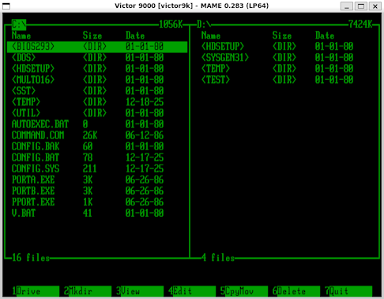

# IGC - File Manager for Victor 9000

A two-pane file manager for Victor 9000 DOS 3.1, inspired by Volkov Commander.



## Known issues / Limitations

- **DOS < 2.11** - Untested
- **DOS 2.11** - Selecting an empty floppy drive falls back to DOS
- **Speed issues** - Uses DOS file access, some things are slow
- **Keys** - Non-Standard/American keyboard configs may not map 100%

## Features

- **Dual-pane interface** - Navigate two directories simultaneously
- **File operations** - Copy, move, delete, rename files and directories
- **Built-in editor** - View and edit text files
- **Dynamic memory scaling** - Works on systems from 128KB to 512KB+ RAM
- **Fast display** - Direct VRAM access for responsive UI
- **Session persistence** - Remembers your last directory locations

## Keyboard Controls

### Navigation
| Key | Action |
|-----|--------|
| Tab | Switch between panels |
| Up/Down | Move cursor |
| PgUp/PgDn | Scroll page (Word arrow keys) |
| Home/End | Jump to first/last file |
| Enter | Open directory or view file |
| Backspace | Go to parent directory |
| Space | Select/deselect file |

### Function Keys
| Key | Action |
|-----|--------|
| F1 | Change drive |
| F2 | Create directory |
| F3 | View file (read-only) |
| F4 | Edit file |
| F5 | Copy/Move |
| F6 | Delete |
| F7 | Quit |

## Installation

Copy `IGC.EXE` to your Victor 9000 hard drive or floppy disk.

## Building from Source

Requires Open Watcom v2 compiler.

```bash
make            # Build igc.exe
make clean      # Remove build artifacts
make deploy     # Deploy to MAME disk image
```

Output: `bin/igc.exe` (~26KB)

## System Requirements

- Victor 9000 / Sirius 1 computer
- DOS 3.1 or compatible
- Minimum 128KB RAM (scales with available memory)

### Memory Scaling

The program automatically adapts to available RAM:

| System Memory | Files per Panel | Editor Buffer |
|---------------|-----------------|---------------|
| 128KB | 64 | 4KB |
| 256KB | 256 | 16KB |
| 384KB | 512 | 32KB |
| 512KB+ | 1024+ | 64KB |

## License

Public domain / educational use.
